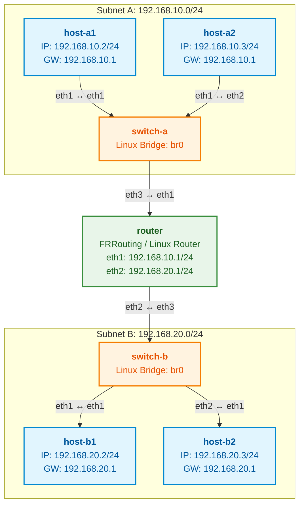

# networking-lab-4hosts-2subnets
## Obective:
In this lab, I build and configure a network topology consisting of **4 hosts divided equally across 2 distinct subnets**, connected via a router (or layer 3 device).

